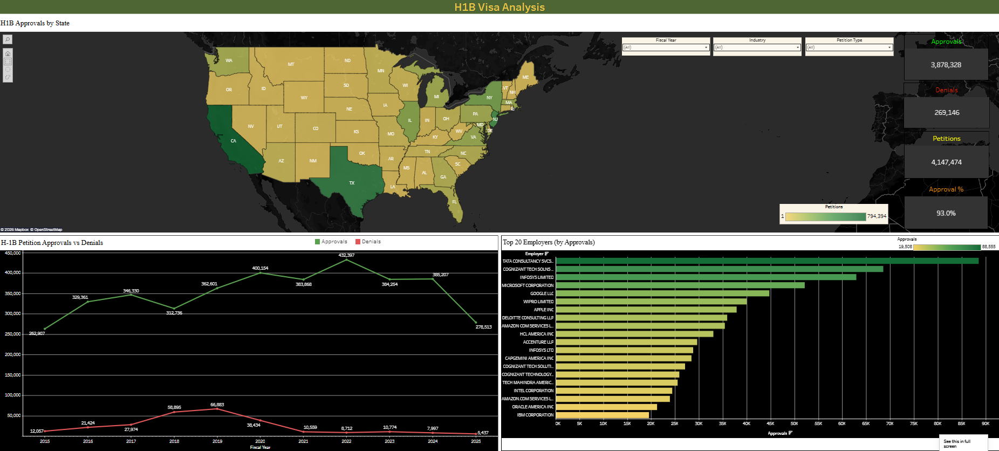

# H-1B Visa Data Analysis

**An interactive Tableau dashboard and Python data pipeline that turn eleven years of raw U.S. government H-1B petition records into an explorable view of approvals, denials, and approval rates across employers, states, industries, fiscal years, and petition types.**

📊 **Live dashboard:** https://public.tableau.com/shared/RJK2P6GQX

📓 **Data pipeline:** [H1B_Data_Analysis.ipynb](H1B_Data_Analysis.ipynb)

---

## Overview

The H-1B visa program allows U.S. employers to hire foreign workers in specialty occupations that require a bachelor's degree or higher. It is one of the primary ways the country addresses labor shortages in specialized fields, especially in technology, and it is a central pathway for high-skilled talent entering the U.S. workforce. Up to 85,000 new H-1B visas are granted each year, and there are an estimated 730,000 H-1B holders currently in the country.

The government publishes detailed petition data, but in its raw form it is dense, split across separate yearly files, and structured in a way that makes exploration difficult without significant reshaping. This project turns that raw data into an interactive dashboard where a user can understand trends in petitions, approvals, denials, and approval rates, and drill down by employer, fiscal year, state, industry, and petition type.

I led the data engineering and dashboard build for this project: sourcing and cleaning the data, designing and implementing the reshaping pipeline in Python, and building the Tableau dashboard along with its filtering and interactivity.

---

## The Data

**Source:** [USCIS H-1B Employer Data Hub](https://www.uscis.gov/tools/reports-and-studies/h-1b-employer-data-hub)

The U.S. Citizenship and Immigration Services maintains public data on the H-1B program. The data is published as one file per fiscal year. This project uses fiscal years 2015 through 2025, roughly 638,000 rows before cleaning.

Each raw row represents a unique combination of fiscal year, employer, industry (NAICS code), city, state, and zip code. It includes the last four digits of the employer Tax ID and approval and denial counts across six petition types:

- New Employment
- Continuation
- Change with Same Employer
- New Concurrent
- Change of Employer
- Amended

A petition can be denied for reasons such as a determination that the role is not a specialty occupation, that the employee is not being paid the prevailing wage, or procedural errors.

---

## Data Pipeline

The cleaning and reshaping is implemented in Python (pandas) in [H1B_Data_Analysis.ipynb](H1B_Data_Analysis.ipynb). The notebook is fully documented with a markdown explanation of each stage.

### Steps

1. **Append** all eleven yearly files into a single dataset.
2. **Clean columns.** Coerce the count columns to numeric (the source has mixed types), drop fields not needed for the dashboard (row ID, Tax ID, zip code), and rename the remaining columns to readable names.
3. **Handle missing values.** Remove incomplete records, since a drill-down dashboard cannot meaningfully filter on rows missing an employer, state, or industry. Keeping nulls would produce confusing empty results for users.
4. **Regroup.** After dropping Tax ID and zip, some rows become near-duplicates, so the data is regrouped by the reference variables and the counts are summed to restore uniqueness.
5. **Reshape wide to long.** The raw data has twelve separate approval and denial columns. These are reshaped into a tidy format with Petition Type as a single dimension and separate Approvals and Denials columns, which is the structure the dashboard needs to filter and drill by petition type.
6. **Calculated fields.** Add total Petitions (approvals plus denials) and Approval % (approvals divided by total petitions).
7. **Final cleanup.** Strip the NAICS code prefix from industry names (so "51 - Information" becomes "Information") and remove the zero-petition rows the reshape created for petition types an employer never used.

### Data integrity

The reshape is the most involved and highest-risk transformation in the pipeline, so total approvals and denials are captured immediately before and after and confirmed to match to the exact count. This guarantees the transformation preserved every record without loss or duplication. The head and describe functions are used throughout to confirm the data looks correct at each stage.

### Performance

The reshape was refactored for performance. An initial melt-and-pivot approach exploded the data to nearly seven million intermediate rows and exceeded available memory on the full dataset. It was rebuilt to construct the long format directly by stacking each petition type's columns, which produces the identical result far more efficiently.

**Output:** `h1b_cleaned.csv`, roughly 907,000 rows at the grain of fiscal year, employer, industry, city, state, and petition type. A 5,000-row sample is included here as [h1b_cleaned_sample.csv](h1b_cleaned_sample.csv); the full dataset is reproducible by running the notebook on the USCIS source files. A small [state_lookup.csv](state_lookup.csv) maps state abbreviations to full names for clean map tooltips in Tableau.

---

## Dashboard

The dashboard is built in Tableau and organized around Shneiderman's visual information-seeking mantra: overview first, then zoom and filter, then details on demand.

### Views

- **Geographic map** of approvals by state, for an at-a-glance overview
- **Approvals versus denials trend** over time, to surface spikes and patterns
- **Top 20 employers** by approvals
- **Scorecards** for total approvals, denials, petitions, and overall approval rate
- **Filters** for fiscal year, industry, and petition type that update every view simultaneously

### Design principles

Design decisions were grounded in established visualization theory rather than made arbitrarily:

- **Graphical integrity.** Part-to-whole encoding for approval rate, nominal comparison with an accurate scale for approvals versus denials to avoid distortion, and time-series and geospatial encodings chosen for effectiveness in line with Mackinlay's rankings.
- **Effective encodings.** Position and length are used for quantitative comparisons, following Cleveland and McGill's findings on perceptual accuracy.
- **Exploratory analysis.** The layout supports pattern detection and outlier spotting, such as identifying sharp movements in denials across years.
- **Multivariate interactivity.** The dashboard combines time, geography, employer, and outcome dimensions, with filters and map navigation enabling user-driven exploration.

### Example user journeys

The dashboard was designed against realistic user needs:

- **A new graduate** seeking a first H-1B in software scans the map at the most recent fiscal year, filters to the technology industry, drills into high-approval states like Washington and California, and compares the top employers by approval rate rather than raw volume to shortlist stable sponsors.
- **A mid-career professional** considering a job change filters to Change of Employer petitions to gauge historical risk, narrows to finance hubs, and verifies that target employers show high approval rates without recent denial spikes.

---

## Tech Stack

| Tool | Use |
|---|---|
| Python (pandas) | Data cleaning, reshaping, validation |
| Jupyter Notebook | Documented, reproducible pipeline |
| Tableau Public | Interactive dashboard |
| USCIS H-1B Employer Data Hub | Data source |

---

## Repository Contents

- `H1B_Data_Analysis.ipynb`: the full cleaning and reshaping pipeline, documented end to end
- `h1b_cleaned_sample.csv`: a 5,000-row sample of the cleaned output
- `state_lookup.csv`: abbreviation-to-name lookup used for map tooltips
- `dashboard_overview.png`: dashboard screenshot

---

## Running the Pipeline

1. Download the yearly files (2015 through 2025) from the [USCIS H-1B Employer Data Hub](https://www.uscis.gov/tools/reports-and-studies/h-1b-employer-data-hub) into the project folder.
2. Open `H1B_Data_Analysis.ipynb` in Jupyter.
3. Run all cells. The pipeline generates the full `h1b_cleaned.csv` locally (the repo includes only a sample), which is the file that feeds the Tableau dashboard.

---
